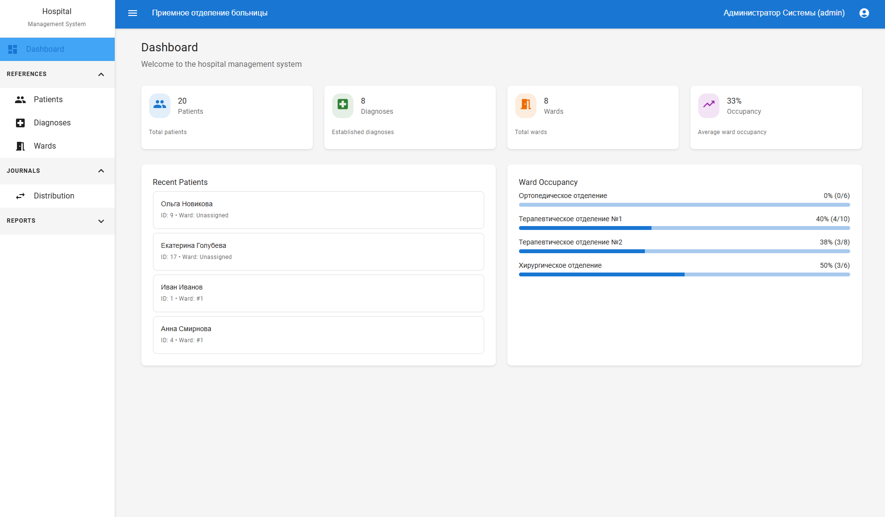
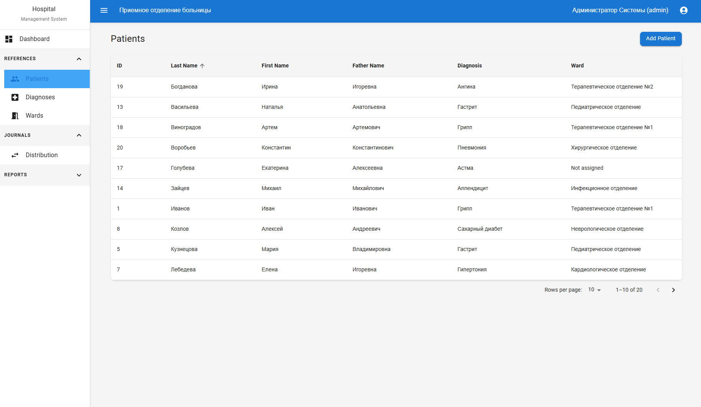
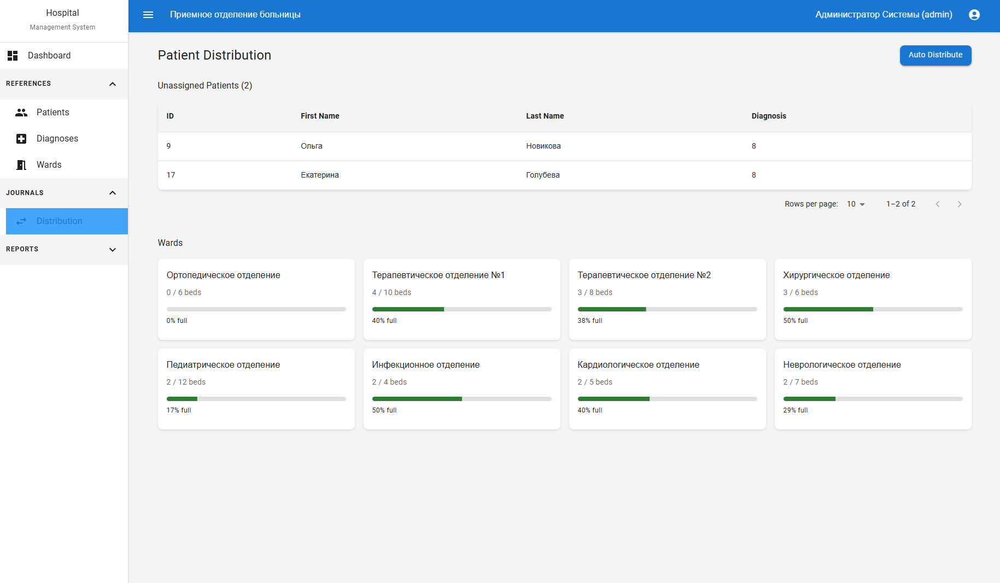

# Hospital Admission Automation System

A web application for managing patient admissions, ward assignments, and hospital workflows.

## Features

- Patient management with medical history
- Automated ward distribution based on diagnosis
- Role-based access (Admin, Doctor, Nurse)
- Real-time dashboard and reporting
- PDF report generation
- Database integrity and transaction management

## Technology Stack

- Frontend: React 19, TypeScript, Material-UI
- Backend: FastAPI, Python 3.13, SQLAlchemy
- Database: PostgreSQL 17
- Containerization: Docker, Docker Compose

## Quick Start

### Using Docker Compose (Recommended)

```bash
# Clone the repository
git clone https://github.com/gurumbay/hospital_management

# Start all services
docker-compose up -d

# Access the application at http://localhost:5173
```

To stop the services:
```bash
docker-compose down
```

### Manual Setup (Development)

1. Install dependencies:
```bash
cd frontend && npm install
cd ../backend && pip install -r requirements.txt
```

2. Start PostgreSQL:
```bash
docker-compose up -d postgres
```

3. Run the application:
```bash
# Backend
cd backend && python main.py

# Frontend (separate terminal)
cd frontend && npm run dev -- --host 0.0.0.0
```

## Interface Preview

### Dashboard


### Patient Management


### Automated Distribution



## Project Structure

```
hospital-admission-system/
├── frontend/          # React application
├── backend/           # FastAPI application
├── docker-compose.yml # Container setup
└── screenshots/       # Interface previews
```

## Key Functionality

- Smart patient allocation to appropriate wards
- Prevention of mixing incompatible diagnoses
- Real-time occupancy tracking
- Secure authentication with JWT tokens
- Automatic validation and error handling

## Troubleshooting

Ensure Docker and Docker Compose are installed and running. Check logs with:
```bash
docker-compose logs
```

For development setup, verify Node.js 18+ and Python 3.13+ are installed.
